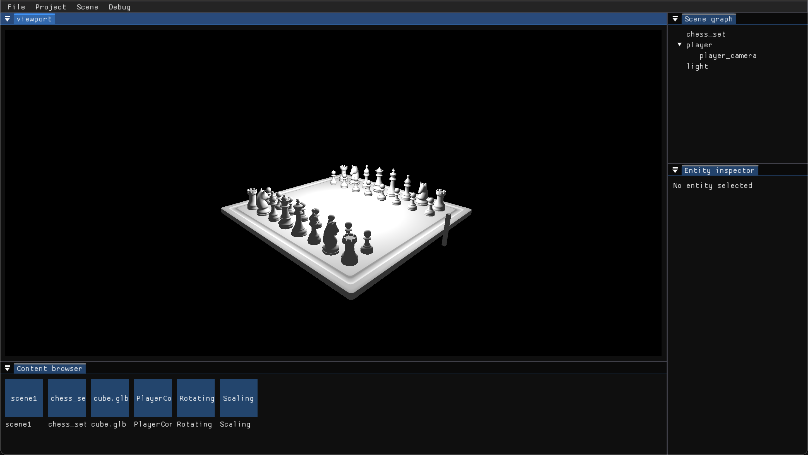
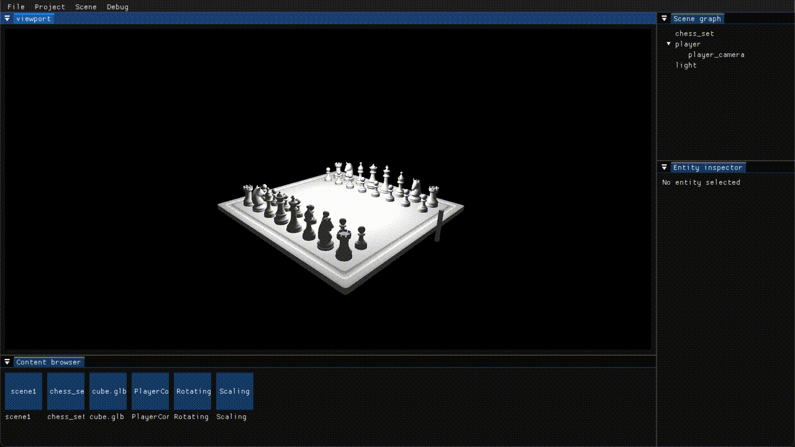

Game-Engine
===========

**Game-Engine** is an ongoing project focused on building a simple, low-level game engine. The primary goal is to deepen my understanding of game development by creating a versatile set of tools that can be used to build various types of games and 3D applications.

Current Features
----------------

- **Basic Renderer**: A simple rendering pipeline for drawing objects on the screen.  
- **Entity Component System (ECS)**: A flexible system for composing game objects with various components.  
- **Editor**: A built-in editor linked to the engine for editing, saving, and running projects.  
- **External Scripting**: Projects can include scripts that are loaded at runtime through shared libraries, allowing scripts to be rebuilt and reloaded without closing the editor.  

### Example Project  

A basic example project is included to demonstrate the engine’s current capabilities. It consists of four entities:  

1. **Player**: An entity with a mesh component and a script enabling player movement.  
2. **Camera**: A camera component attached as a child of the player, ensuring it moves along with the player.  
3. **Chess Set**: A static entity with a mesh component.  
4. **Light**: A point light component illuminating the scene.  

To run the game, use the **Project > Run** menu option.  

<p float="left">
  
   
</p>  

Support
------

| Platform | Supported | Graphics API   |
|----------|-----------|----------------|
| Windows  | Yes       | OpenGL         |
| Linux    | Yes       | OpenGL         |
| macOS    | Yes       | Metal / OpenGL |

Building the Project  
--------------------

The repository must be **cloned** (instead of downloaded as a ZIP) to correctly resolve submodules when configuring the project with CMake. Recursive cloning is not required, as everything is managed through CMake.  

### Build Instructions  

```sh
mkdir build
cmake -S . -B build
cmake --build build
```  

All dependencies are embedded in the project using either **Git submodules** or **CMake's FetchContent**, so it should work out of the box. However, if compilation fails, ensure that your system meets the requirements for each dependency.  

### CMake Options  

| Option              | Default | Description                          |
|---------------------|---------|--------------------------------------|
| `GE_BUILD_EXAMPLES` |  `OFF`  | Build example projects               |
| `GE_BUILD_TESTS`    |  `OFF`  | Build unit tests                     |
| `GE_BUILD_METAL`    |  `ON`   | Build the Metal backend (macOS only) |
| `GE_BUILD_OPENGL`   |  `ON`   | Build the OpenGL backend             |

Libraries
---------

This project utilizes a combination of **custom-built** and **open-source** libraries.  

### Custom Libraries  

I’ve developed the following libraries :  

- **[UtilsCPP](https://github.com/Thomas-Chqt/UtilsCPP)** – A utility library with various data structures and algorithms.  
- **[Math](https://github.com/Thomas-Chqt/Math)** – A math library providing vector and matrix operations for graphics.  
- **[Graphics](https://github.com/Thomas-Chqt/Graphics)** – An abstraction layer over multiple graphics APIs, enabling cross-platform compatibility with the most native API per platform.  

### Open-Source Libraries  

The engine also integrates several open-source libraries:  

- **[GLFW](https://github.com/glfw/glfw)** – Handles window creation and input events (used internally by **Graphics**).  
- **[GLAD](https://github.com/Thomas-Chqt/GLAD)** – Loads OpenGL functions for cross-platform rendering (used internally by **Graphics**).  
- **[assimp](https://github.com/assimp/assimp)** – Imports 3D models and meshes for asset loading.  
- **[stb_image](https://github.com/Thomas-Chqt/stb_image)** – A lightweight image-loading library for textures.  
- **[imgui](https://github.com/Thomas-Chqt/imgui)** – A UI framework for building efficient in-engine interfaces.  
- **[tinyfiledialogs](http://tinyfiledialogs.sourceforge.net)** – Provides a native file picker for all platforms.  
- **[nlohmann/json](https://github.com/nlohmann/json)** – Parses and writes JSON files.  

Additionally, unit tests are built using **[GoogleTest](https://github.com/google/googletest)**.  
