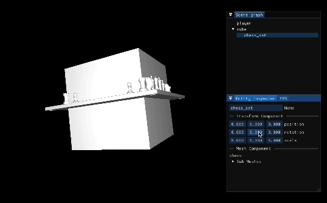
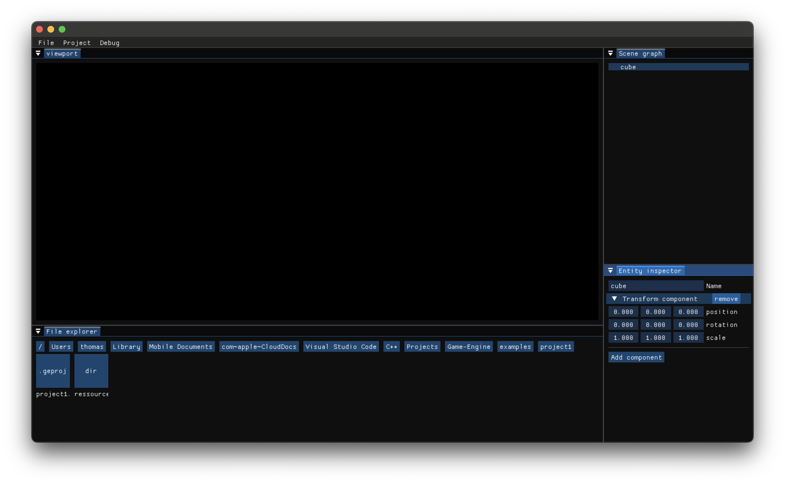

Game-Engine
===========

**Game-Engine** is an ongoing project focused on building a simple, low-level game engine. The primary goal is to expand my knowledge of game development by creating a versatile set of tools that can be used to build various types of games or 3D applications.  
I chose to build a game engine instead of a specific game because it challenges me to implement a broad range of capabilities. This approach allows me to develop skills in multiple areas of game development, rather than focusing on the limited features required for a single game.

Project Overview
----------------

The project is still in its early stages, and the master branch contains the latest stable code. Additional branches are used for development and may require substantial code refactoring as new features and improvements are implemented.

Current Features (Master Branch)
--------------------------------

The master branch currently provides:

- **Entity Component System (ECS)**: This system allows for the flexible composition of game objects with different components.
- **Basic Renderer**: A simple rendering pipeline is included for drawing objects on the screen.
- **Render Loop Management**: The engine handles the render loop and triggers the appropriate callbacks for game logic and rendering.

### Example Program

A basic example program is included to demonstrate the engine’s current capabilities. The scene consists of three entities:

1. **Player**: An entity with a camera component and a script that allows player movement.
2. **Rotating Cube**: An entity with a mesh component and a script that makes the cube rotate continuously.
3. **Chess Set**: A child entity of the cube, also with a mesh component but without any attached script. When the cube moves, the chess set moves along with it due to the parent-child relationship.

Additionally, the example program includes a simple UI for modifying the scene, showcasing basic interaction with the engine.

<p align="center">
  
</p>

Next Steps
----------

The next major milestone is to develop a full-featured editor that allows users to open and save projects, as well as visually edit scenes. This development is actively ongoing in the editor branch.

Building the editor requires a significant shift in the engine’s architecture. Currently, the engine functions as a simple library linked to a game, but it will evolve into a standalone application. The editor will dynamically load game code, enabling users to modify and rebuild the game without needing to restart the editor.

This architectural change prioritizes project management and scene editing functionality, temporarily shifting focus away from rendering features.

Here’s a preview of the editor design:

<p align="center">
  
</p>

Support
------

| Platform | Supported | Graphic API     |
|----------|-----------|-----------------|
| Windows  | YES       | OpenGL          |
| Linux    | YES       | OpenGL          |
| MacOS    | YES       | Metal or OpenGL |

Build
-----

The repository must be cloned instead of downloading it as a zip file in order to resolve the submodules when configuring the project with CMake. Recursive cloning is not required as everything is managed through CMake.

```sh
mkdir build
cmake -S . -B build
cmake --build build
```

All dependencies are embedded in the project using either Git submodules or CMake's FetchContent, so it should work out of the box. However, if compilation fails, please verify the requirements for each dependency, especially GLFW on Linux.

### CMake Options

| Option              | Default Value | Description                          |
|-------------------- |---------------|--------------------------------------|
| `GE_BUILD_EXEMPLES` | `OFF`         | Build example applications           |
| `GE_BUILD_TESTS`    | `OFF`         | Build unit tests                     |
| `GE_INSTALL `       | `ON`          | Enable installation of the library   |
| `GE_BUILD_METAL`    | `ON`          | Build the Metal backend (macOS only) |
| `GE_BUILD_OPENGL`   | `ON`          | Build the OpenGL backend             |

Libraries
---------

The project relies on both custom-built and open-source libraries:

### Custom Libraries

I’ve developed the following libraries for use in this project:

- **[UtilsCPP](https://github.com/Thomas-Chqt/UtilsCPP)**: A utility library containing various data structures and algorithms for general functionality.
- **[Math](https://github.com/Thomas-Chqt/Math)**: A math library providing vector and matrix classes and functions essential for graphics operations.
- **[Graphics](https://github.com/Thomas-Chqt/Graphics)**: An abstraction layer on top of multiple graphics APIs, enabling the use of the most native API on every platform with the same codebase.
  - **[GLFW](https://github.com/glfw/glfw)**: A popular open-source library used for creating windows and handling input events. Used internaly by **Graphics**
  - **[GLAD](https://github.com/Thomas-Chqt/GLAD)**: A library for loading OpenGL functions, ensuring that all necessary OpenGL extensions are available for cross-platform rendering. Used internaly by **Graphics**

### Open-Source Libraries

The project also integrates the following open-source libraries:

- **[assimp](https://github.com/assimp/assimp)**: A library for importing 3D models and meshes, commonly used for asset loading.
- **[stb_image](https://github.com/Thomas-Chqt/stb_image)**: A lightweight image loading library useful for loading textures in the project.
- **[imgui](https://github.com/Thomas-Chqt/imgui)**: A library for building efficient user interfaces.

Additionally, the test executable uses [GooleTest](https://github.com/google/googletest) for creating unit tests.
