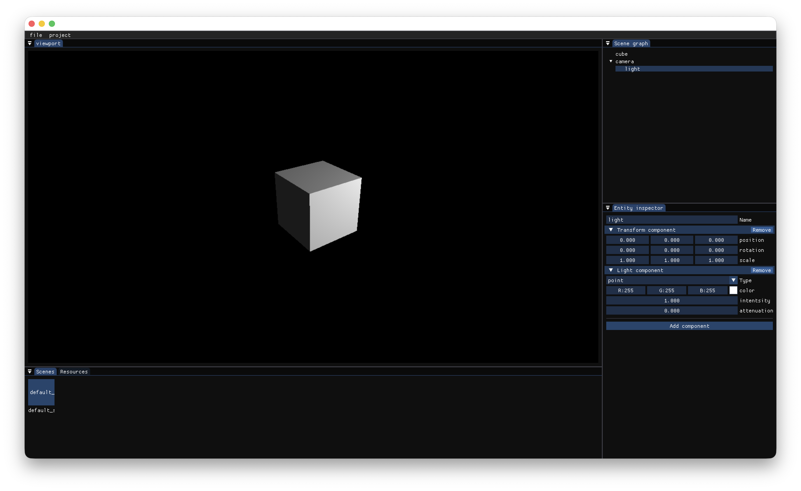
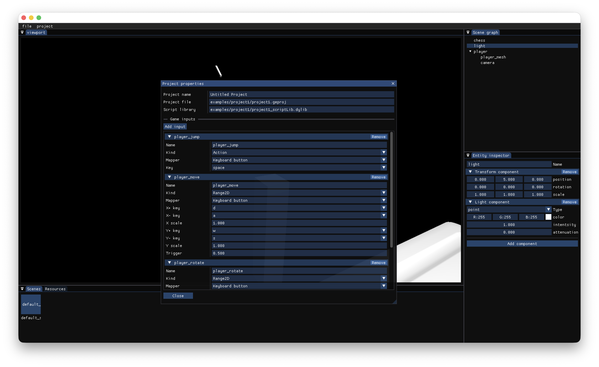

# Game-Engine

`Game-Engine` is a small C++23 game engine and editor built as a learning project around rendering, tooling, and runtime architecture. It includes a reusable engine library, a desktop editor, YAML-based project and scene serialization, and hot-reloadable C++ gameplay scripts.



## Current Features

- Frame-graph-based renderer
- Metal backend on macOS and Vulkan backend where enabled
- Entity Component System
- Scene hierarchy
- ImGui-based editor with viewport, scene graph, inspector, project properties, and resource management panels
- Runtime game mode inside the editor
- Hot-reloadable gameplay scripts written in C++
- Reflected script fields exposed to the editor and serialization
- YAML project, scene, input, and component serialization
- Input system
- Mesh importing with `assimp`
- Texture loading with `stb_image`
- Automated tests for core engine systems

## Example Project

The repository includes `examples/project1`, a sample project that demonstrates the current engine and editor workflow. It contains:

- A chess-set scene with imported meshes, textures, lighting, and camera setup
- A set of inputs and there mappers
- A Player controller script attached to the player entity

It can be opened from the project root with `./path/to/editor examples/project1/project1.geproj`.

<p float="left">
  </img>
  </img>
</p>

## Build

### Supported Platforms

| Platform | Metal | Vulkan |
|----------|-------|--------|
| macOS    | [](https://github.com/Thomas-Chqt/Game-Engine/actions/workflows/macos-metal.yml) | [](https://github.com/Thomas-Chqt/Game-Engine/actions/workflows/macos-vulkan.yml) |
| Windows  | N/A | [](https://github.com/Thomas-Chqt/Game-Engine/actions/workflows/windows.yml) |
| Linux    | N/A | [](https://github.com/Thomas-Chqt/Game-Engine/actions/workflows/linux.yml) |

### Requirements

- CMake
- A C++23 compiler (out of the box on macos and windows, require gcc-14 on ubuntu)
- see [`Graphics`](https://github.com/Thomas-Chqt/Graphics) for backends requirements

### Configure and Build

```sh
cmake -S . -B build
cmake --build build
```

This builds the `Game-Engine` library, the `GE-Editor` application, and the required shader compilation targets.  
To build the example project, add the `-DGE_BUILD_EXAMPLES=ON` flag

### Useful CMake Options

| Option              | Default       | Description                                                 |
| ------------------- | ------------- | ----------------------------------------------------------- |
| `BUILD_SHARED_LIBS` | `OFF`         | Build libraries as shared instead of static where supported |
| `GE_BUILD_METAL`    | `ON` on macOS | Enable the Metal backend                                    |
| `GE_BUILD_VULKAN`   | `ON`          | Enable the Vulkan backend                                   |
| `GE_BUILD_TESTS`    | `OFF`         | Build the test target                                       |
| `GE_BUILD_EXAMPLES` | `OFF`         | Build the example project script library                    |
| `GE_INSTALL`        | `ON`          | Enable install rules in dependencies that support them      |

## Libraries Used

- [`Graphics`](https://github.com/Thomas-Chqt/Graphics): rendering abstraction layer and shader toolchain
- [`GLFW`](https://github.com/glfw/glfw): windowing and input
- [`GLM`](https://github.com/g-truc/glm): math types and transforms
- [`imgui`](https://github.com/Thomas-Chqt/imgui): editor UI
- [`stb_image`](https://github.com/Thomas-Chqt/stb_image): image loading
- [`assimp`](https://github.com/assimp/assimp): mesh import
- [`yaml-cpp`](https://github.com/jbeder/yaml-cpp): YAML serialization
- [`dlLoad`](https://github.com/Thomas-Chqt/dlLoad): dynamic library loading for scripts
- [`GoogleTest`](https://github.com/google/googletest): unit tests
